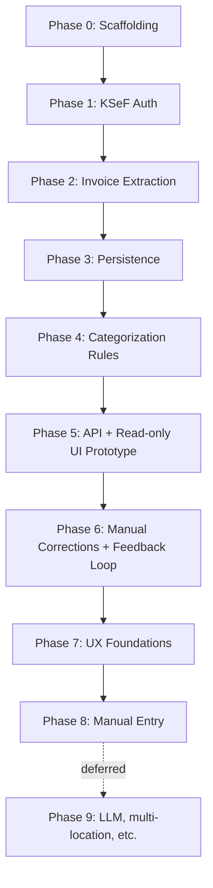

# KSeF Exporter — Implementation Plan

**Last updated:** 2026-08-10 16:33

**Companion document to** [`SPEC.md`](./SPEC.md). Read that first for the business context and KSeF integration mechanics — this document is the step-by-step build order.

**Audience:** Developers / AI coding agents implementing this system.

---

## Engineering conventions (apply to every phase below)

- **Testing is mandatory, not optional.** Every feature or change implemented from this plan must ship with automated tests covering it. A feature is only considered "done" once its tests exist **and pass** (verified by actually running them). Never report a phase/task as complete without this.
- **Test framework:** [Vitest](https://vitest.dev/).
- **No real network calls to KSeF in unit tests.** All KSeF HTTP interactions must be mockable/injectable (e.g. via `ksef-client`'s options or an HTTP mocking layer) so the default test run is fast, deterministic, and doesn't depend on external systems. Optional integration tests against `https://api-test.ksef.mf.gov.pl` may be added later, gated behind an environment variable so they don't run by default.
- **Language/runtime:** TypeScript, Node.js ≥ 22.13 (`ksef-client` requires ≥ 20, but the pinned pnpm 11 runtime requires ≥ 22.13). Use the version in `.nvmrc`.
- **Package manager:** pnpm.
- **Linting/formatting:** [Biome](https://biomejs.dev/) — a single fast tool replacing ESLint + Prettier; type-aware checks are still covered separately via `tsc --noEmit` (`pnpm run typecheck`).
- **Database:** SQLite via [Drizzle ORM](https://orm.drizzle.team/) — zero-ops, fits self-hosted single-user deployment; swappable later if multi-user/cloud requires it.
- **API layer (from Phase 5 onward):** [Fastify](https://fastify.io/) — lightweight, TypeScript-friendly.
- **Structure:** start as a single package (root-level `src/`) organized by domain module. A separate frontend app is introduced at Phase 5 (as soon as there's something worth looking at); restructure into a workspace at that point if needed, not before.

## Current implementation status

Phases 0–7 are implemented. Phase 8 is the next active phase; its shared persistence primitive (`insertManualInvoice`) and `source = "manual"` schema support already exist from Phase 3, but there is no manual-entry domain service, API route, form, or feature-level test yet. Phase 9 remains explicitly deferred.

Two companion workstreams do not renumber or replace Phase 8:

- **[`IMPORT_OBSERVABILITY_PLAN.md`](./IMPORT_OBSERVABILITY_PLAN.md)** — implemented. Imports now have correlated structured lifecycle logs, durable timings/continuation/count/error diagnostics, expandable UI details, safe error classification, and sanitized startup context. Quota, retry, continuation, and export-window behavior was intentionally unchanged.
- **[`INVOICE_ITEMS_PLAN.md`](./INVOICE_ITEMS_PLAN.md)** — pending. Line-item persistence and display: schema, parser, repository, sync integration, backfill, API, and expandable-row UI to query the complete `raw_xml` structure of all 2 437 imported invoice items.

Verified on 2026-08-10 with Node 22.23.1: 125 backend tests and 30 frontend tests pass; backend and frontend typechecks and production builds pass. Biome passes for tracked source files (the only warning is the oversized, untracked `design/chat.json` chat export, which must not be committed).

---

## Phase 0 — Project scaffolding

**Goal:** A working, tested, lintable TypeScript project skeleton with CI-ready tooling — nothing KSeF-specific yet.

Tasks:
- `pnpm init`, TypeScript config (`tsconfig.json`), strict mode on.
- Biome config (`biome.json`) for linting + formatting.
- Vitest configured and runnable (`pnpm test`).
- Basic folder layout: `src/`, `src/config/` (env loading/validation), `test/` or co-located `*.test.ts`.
- `.env.example` documenting required environment variables as they're introduced in later phases.
- A trivial smoke test (e.g. config loader test) to prove the pipeline works end-to-end.

Definition of done: `pnpm run lint`, `pnpm run build`, and `pnpm test` all succeed on a clean checkout.

**Status: done.** Scaffolding in place (`package.json`, `tsconfig.json`, `biome.json`, `vitest.config.ts`, `.env.example`, `.gitignore`, `pnpm-workspace.yaml`) plus the Phase 1 config loader (`src/config/env.ts`) and its tests (`src/config/env.test.ts`) as the smoke test. `pnpm run typecheck`, `pnpm run lint`, and `pnpm test` all pass. pnpm pinned at `11.10.0` (installed via Homebrew).

---

## Phase 1 — KSeF authentication module

**Goal:** Obtain and maintain a valid `accessToken` automatically, per SPEC §3.1, without human interaction beyond the one-time KSeF Token setup.

Tasks:
- Add `ksef-client` dependency.
- `src/ksef/auth.ts`: wraps the KSeF-token auth flow (challenge → encrypt → submit → poll → redeem) behind a small internal interface, e.g. `KsefAuthService.getAccessToken()`.
- Token lifecycle handling: cache `accessToken` in memory with expiry tracking; transparently refresh via `refreshToken`; transparently re-run full auth when `refreshToken` is no longer valid.
- Config: `KSEF_TOKEN`, `KSEF_NIP`, `KSEF_ENVIRONMENT` (`TEST`/`DEMO`/`PRD`) read via the Phase 0 config loader, validated at startup (fail fast with a clear error if missing).
- Secrets hygiene: never log token values; redact in error messages.

Tests (mocked KSeF API, no real network calls):
- Successful auth flow end-to-end (challenge → encrypted submit → poll success → redeem) returns a usable access token.
- Token reuse: a second call within the token's validity window does **not** re-trigger the full auth flow.
- Refresh path: an expired `accessToken` but valid `refreshToken` triggers `/auth/token/refresh`, not a full re-auth.
- Full re-auth path: an expired `refreshToken` triggers the complete flow again from `/auth/challenge`.
- Failure handling: auth status polling that returns a failure/error status surfaces a clear, typed error (not a hang or generic crash).
- Config validation: missing/invalid `KSEF_TOKEN`/`KSEF_NIP` fails fast with a descriptive error.

Definition of done: all tests above pass; a manual `.env`-driven smoke script can obtain a token against the **test** KSeF environment (documented, not part of the automated suite).

**Status: done.** `ksef-client` (community TS SDK, per SPEC §3.5) already implements the full challenge→encrypt→submit→poll→redeem flow inside `KsefClient.connect()`, and transparently refreshes the access token via `AuthManager.getAccessToken()`. `src/ksef/client.ts` wraps this in a `KsefSessionManager`: lazily connects once, delegates token refresh entirely to the SDK, and transparently re-runs the full auth flow (at most once) when the SDK signals `KsefSessionExpiredError` (refresh token dead). Connection is injected (`ConnectFn`) so tests never touch the network. `src/ksef/client.test.ts` covers: happy path, session reuse (no re-auth), delegated access-token refresh, full re-auth on session expiry, no infinite retry loop, and connection-failure propagation/retry-ability — 7 tests, all passing. `src/ksef/smoke.ts` (`pnpm run smoke:ksef`) is the manual, non-automated real-environment check called for above.

---

## Phase 2 — Invoice extraction module

**Goal:** Reliably pull all purchase invoices for a given date range from KSeF into flat, de-duplicated records, per SPEC §3.2.

Tasks:
- `src/ksef/export.ts`: initiate `/invoices/exports` with `subjectType=Subject2`, `dateType=PermanentStorage`, client-generated encryption; poll `/invoices/exports/{referenceNumber}` until complete.
- `src/ksef/package.ts`: download package parts, AES-256 decrypt, unzip, parse `_metadata.json`.
- `src/ksef/invoice-parser.ts`: parse invoice XML (FA(2)/FA(3)) into the flat header record from SPEC §3.4 (KSeF number, seller/buyer NIP+name, dates, totals, currency); retain raw XML.
- `src/ksef/sync.ts`: orchestrates the High-Water-Mark continuation logic — given a starting point (or none, for first run), fetches one or more contiguous windows, de-duplicates by KSeF number, and returns the new HWM to persist for next time.
- Persist HWM state (initially can be a simple table/row via the Phase 3 DB layer, introduced next — sequence these two phases together if convenient).

Tests (mocked KSeF API + fixture invoice XML/zip data):
- Happy path: a single non-truncated export window produces the expected parsed invoices and an updated HWM equal to `permanentStorageHwmDate`.
- Truncated package: `isTruncated=true` response causes continuation from `lastPermanentStorageDate` on the next call, not `permanentStorageHwmDate`.
- De-duplication: an invoice appearing in two overlapping/adjacent windows' `_metadata.json` is only stored/returned once.
- Rate limiting: a `429` response with `Retry-After` is retried rather than failing immediately (verify backoff behavior, not necessarily real timing — inject a fake clock/timer).
- XML parsing: a representative FA(2) and FA(3) sample invoice each parse into the correct flat record shape.
- Corrupted/undecryptable package part surfaces a clear error rather than crashing silently or returning partial garbage data.

Definition of done: all tests above pass; running the sync module against recorded fixture data produces the exact expected set of invoice records with no duplicates and no gaps.

**Status: done — architecture simplified vs. the plan above.** Investigation of `ksef-client` showed it already exposes `client.workflows.exportsIncremental` (`IncrementalExportWorkflow`), which fully implements start-export → poll → download parts → AES-256 decrypt → unzip → dedupe-by-KSeF-number → HWM continuation-point tracking (defaulting to `dateType: PermanentStorage`), i.e. everything `src/ksef/export.ts`/`package.ts`/`sync.ts` were planned to do. Reimplementing that would have been pure duplication of well-tested SDK code, so instead:
- `src/ksef/invoices.ts`: `fetchPurchaseInvoices(client, options)` — a thin adapter calling `client.workflows.exportsIncremental.run({ subjectType: "Subject2", ... , requireExportPartHash: true })`, then parses each returned invoice XML file into our flat model, matching each to its metadata (for the authoritative KSeF number) by file name.
- `src/ksef/invoice-parser.ts`: `parsePurchaseInvoiceXml(fileName, xml, metadata?)` — parses FA(2)/FA(3) invoice XML (via `fast-xml-parser`) into a `PurchaseInvoiceRecord` (SPEC §3.4). Field paths verified directly against the official bundled schema (`schemat_FA(3)_v1-0E.xsd`): `Faktura/Podmiot{1,2}/DaneIdentyfikacyjne/{NIP,Nazwa}` and `Faktura/Fa/{P_1,P_2,P_15,KodWaluty}` (these `P_n` field codes are stable across FA versions). The KSeF number itself isn't part of the invoice XML — it's taken from the matching `_metadata.json` entry (`ksefNumber`/`KsefNumber`), falling back to deriving it from the export package's file name (validated via the SDK's own `validateKsefNumber`) if no metadata match exists. Missing required fields raise a typed `InvoiceParsingError` rather than silently producing an incomplete record.
- Rate-limit handling (`429`/`Retry-After`) and part-hash verification: part-hash verification is handled internally by the SDK's workflow (`requireExportPartHash: true`), not reimplemented. **Correction (2026-07-11):** `429`/`Retry-After` handling is *not* automatic in the SDK — a `429` from `startExport` simply throws (`KsefRateLimitError`), surfaced by `src/ksef/rate-limit.ts`'s `formatKsefError()` as a friendly, retry-after-aware message for the human to act on. There is no built-in retry/backoff loop anywhere in the app; see Phase 4's status for the related `maxIterations` fix.
- Tests: `src/ksef/invoice-parser.test.ts` (7 tests: happy path, KSeF-number-from-metadata vs. from-filename fallback, both metadata casings, comma-decimal amount normalization, malformed XML, missing-fields aggregation, invalid filename-derived number rejected) and `src/ksef/invoices.test.ts` (4 tests: correct `Subject2`/`PermanentStorage`/`requireExportPartHash` call shape, XML-to-record mapping incl. metadata matching, parse-error propagation, pass-through of polling/iteration options) — all mocking `client.workflows.exportsIncremental.run` via dependency injection, no real network calls. 11 new tests, all passing.
- Persistence of continuation points (HWM state) across runs is deferred to Phase 3 as originally planned — this phase returns the updated `continuationPoints` for the caller to persist.

---

## Phase 3 — Persistence layer

**Goal:** Durable local storage for invoices, categorization rules, category assignments, manual entries, and sync state.

Tasks:
- Drizzle schema (SQLite) covering (at minimum):
  - `invoices` (KSeF-sourced + manual, distinguished by a `source` column per SPEC §4).
  - `categories` (Media / Zakup towarów / Inne, extensible).
  - `categorization_rules` (condition → category, e.g. seller NIP or name-contains match, per SPEC §2.6 seed rules).
  - `sync_state` (HWM continuation point per subject type).
- Migration tooling wired up (`drizzle-kit` or equivalent) and a documented `pnpm run migrate` command.
- Repository/data-access modules (`src/db/invoices.ts`, `src/db/rules.ts`, etc.) — thin, typed wrappers, no business logic here.

Tests:
- Schema/migration applies cleanly to a fresh SQLite file.
- CRUD round-trip tests for each repository module (insert/read/update invoices, rules, sync state).
- Uniqueness constraint test: inserting the same KSeF invoice number twice is rejected or upserted safely (matches the de-dup guarantee from Phase 2).

Definition of done: all tests above pass against a real (file or in-memory) SQLite instance created fresh per test run.

**Status: done.** `src/db/schema.ts` defines all four tables via Drizzle (SQLite), matching the plan exactly, plus a unique index on `invoices.ksef_number` (SQLite treats each `NULL` as distinct, so manual entries with no KSeF number never collide) and on `categorization_rules(match_type, match_value)`. Migrations are generated with `pnpm run db:generate` (drizzle-kit) into `drizzle/migrations/`, and applied automatically by `src/db/client.ts`'s `createDb(path)` (use `":memory:"` for tests; `pnpm run migrate` applies them to a real file). `DATABASE_PATH` added to the Phase 0 config loader (default `./data/ksef-exporter.sqlite`); its parent directory is created automatically if missing. Repository modules: `src/db/categories.ts`, `src/db/invoices.ts` (`insertKsefInvoiceIfNotExists` upserts safely — re-syncing the same invoice never duplicates it or clobbers an already-assigned category), `src/db/rules.ts` (`upsertRule` updates in place on conflict, per the Phase 5 feedback-loop requirement), `src/db/sync-state.ts` (HWM continuation point per subject type, for Phase 2's `continuationPoints`). 21 new tests across 5 files (`client`, `categories`, `invoices`, `rules`, `sync-state`), all passing against a fresh in-memory (or, for one directory-creation test, temp-file) SQLite database per test.

---

## Phase 4 — Categorization engine (Tier 1 rules)

**Goal:** Deterministic categorization of invoices per SPEC §4, seeded with the rules from SPEC §2.6.

Tasks:
- `src/categorization/engine.ts`: given an invoice record and the current rule set, return a category + a confidence flag (`matched` vs `needs_review`).
- Rule matching: seller NIP exact match preferred; seller-name substring match as fallback/bootstrap (seed data from SPEC §2.6).
- Seed migration/script to load the initial rule set from SPEC §2.6 into `categorization_rules` on first run.
- Integration point: after Phase 2 sync produces invoices and Phase 3 persists them, run each new invoice through the engine and persist the resulting category + confidence.

Tests:
- Each seed rule (Energa/Enea/PGNiG/T-Mobile/Wodociągi/Odpady → Media; Eurocash/Piwowar/Pepsi/Triada → Zakup towarów; Ochrona/Securitas/Leasing/Skoda/OBI/Castorama → Inne) categorizes a matching sample invoice correctly.
- An invoice matching no rule is flagged `needs_review`, not silently mis-categorized.
- NIP match takes precedence over a name-based rule when both could apply (if/when both exist for the same seller).
- Engine is a pure function of (invoice, rule set) — same inputs always produce the same output (no hidden state/order-dependence bugs).

Definition of done: all tests above pass; running the engine over the full seed-rule test matrix from SPEC §2.6 produces 100% expected matches.

**Status: done.** `src/categorization/engine.ts` exports `categorize(invoice, rules)`, a pure function: seller-NIP exact match (`matchType: "seller_nip"`) is checked first, falling back to a case-insensitive seller-name substring match (`matchType: "seller_name_contains"`); no match returns `{ categoryId: null, confidence: "needs_review" }`. `src/categorization/seed-rules.ts` (`seedCategorizationRules(db)`) idempotently creates the three SPEC §2.6 categories (Media, Zakup towarów, Inne) and upserts the seed name-substring rules — safe to call on every startup. `src/sync.ts` (`syncPurchaseInvoices(db, client, options, deps?)`) is the integration point: runs Phase 2's `fetchPurchaseInvoices`, persists each invoice via Phase 3's `insertKsefInvoiceIfNotExists`, then runs the engine and persists the category **only** for invoices that are still untouched (`categoryId === null && confidence === "needs_review"`) — re-syncing or overlapping windows never clobbers a category a previous sync or a human already assigned. The KSeF client's fetch call is injectable (`deps.fetchInvoices`) for testability, consistent with the DI pattern used in `src/ksef/client.ts`. Tests: `src/categorization/engine.test.ts` (7 tests: NIP match, name-substring match, case-insensitivity, unmatched → needs_review, NIP-over-name precedence, purity, null-NIP handling), `src/categorization/seed-rules.test.ts` (4 tests: seed categories created, idempotent re-run, full SPEC §2.6 matrix categorizes 100% correctly, unmatched seller flagged needs_review), `src/sync.test.ts` (5 tests: new invoice auto-categorized, unmatched invoice flagged needs_review, human correction never overwritten on re-sync, continuation point persisted, stored continuation point passed into the next fetch call) — 16 new tests, all passing.

**Real-usage rate-limit fix (2026-07-11):** a real import hit repeated `429`s because `syncPurchaseInvoices` was forwarding `options.maxIterations` straight through to `fetchPurchaseInvoices` only when explicitly set, leaving the SDK's own default (`maxIterations: 20`) in effect — a single `/sync` trigger could internally issue up to 20 `POST /invoices/exports` calls against an endpoint capped at 16/min and 20/h (see SPEC §3.3), exhausting the hourly budget in one click, with no partial progress persisted if a later iteration then failed. Fixed by defaulting `maxIterations` to **1**: `syncPurchaseInvoices` now always passes `options.maxIterations ?? 1`, so each call fetches at most one KSeF export page — it either fetches-and-persists a full page or fails before fetching anything, closing the partial-progress-loss gap for the common single-click case. `SyncPurchaseInvoicesResult` gained a `hasMore` field (a heuristic comparing the new continuation point against the requested `windowTo`, since the SDK's aggregate result doesn't expose an exact `isTruncated` flag), surfaced through `POST /sync`'s response and a "click Import again to continue" hint in `SyncButton`. The `smoke-invoices.ts`/`dump-invoices.ts` manual scripts already pass their own explicit `maxIterations` and are unaffected. 4 new tests added across `src/sync.test.ts`, `src/api/server.test.ts`, and `web/src/components/SyncButton.test.tsx`.

---

## Phase 5 — Engine API + read-only UI (prototype milestone)

**Goal:** Make the already-working engine (Phases 0–4: auth, extraction, persistence, Tier-1 categorization) *visible*, so the owner can look at real categorized invoices and give feedback before more backend logic is built.

**Replanning note (2026-07):** originally the API layer and UI were separate, later phases (old Phase 7/8), built only after *all* backend features (corrections, manual entry) existed. Re-sequenced to a vertical-slice model instead: ship a minimal end-to-end increment now, then add correction (Phase 6) and manual entry (Phase 7) as their own backend+API+UI slices. This gets a testable prototype in front of the owner far earlier, at the cost of that first look being view-only (no corrections or manual entry yet — call this out explicitly when sharing it).

Tasks:
- Fastify app (`src/api/server.ts`) with, at minimum:
  - `POST /auth/login` — minimal JWT auth (single env-configured user/password; no user-management system needed for a single-owner, self-hosted app) per SPEC §2.2.4 — a hard requirement even at this early stage, not a stub to skip.
  - `POST /sync` — trigger a KSeF fetch for a given month/date range (HU-01), invoking Phase 4's `syncPurchaseInvoices`.
  - `GET /invoices` — list invoices with category + confidence, filterable by month/category.
  - Auth middleware protecting `/sync` and `/invoices`.
  - Input validation and consistent error responses.
- Frontend framework decision made now (e.g. a lightweight React + Vite app) since this is where the first UI code lands.
- Minimal UI:
  - Login screen (JWT auth against the API above).
  - One-click "fetch this month" trigger calling `POST /sync` (HU-01).
  - Table view grouped/filterable by category, with a clear visual distinction between "confident" and "needs review" rows (HU-03).
  - **Explicitly out of scope here:** category correction (HU-04) and manual entry (HU-02) — no stubbed buttons/dead links for these; they arrive with their own backend logic in Phases 6–7.

Tests:
- API: each route's happy path + at least one validation/error-path test, using Fastify's injectable test client (no real HTTP server needed). Auth: unauthenticated requests to protected routes are rejected; authenticated requests succeed. `POST /sync` tested with the Phase 4 sync module mocked at this layer (its own correctness is already covered by Phase 2–4 tests).
- UI: component/unit tests for the table view and the sync trigger (Vitest + a component-testing library appropriate to the chosen framework).

Definition of done: all tests above pass; a person can log in, trigger a sync, and see real categorized invoices in a table with no manual steps in between. **This is the milestone to demo to the owner for feedback.**

**Status: done.** `src/api/server.ts` (`buildServer(deps)`) is a fully dependency-injected Fastify app — `db`, `getClient`, and `sync` are all injected, so the API is unit-tested with `fastify.inject()` and no real KSeF connection or HTTP socket. Implements `POST /auth/login` (constant-time credential check via `src/api/auth.ts`'s `verifyCredentials`, using SHA-256-then-`timingSafeEqual` so mismatched-length candidates don't leak via early rejection; issues a 12h JWT via `@fastify/jwt`), `POST /sync` (zod-validated body, calls Phase 4's `syncPurchaseInvoices`), `GET /invoices` (zod-validated `month`/`categoryId` filters, extending `listInvoices` in `src/db/invoices.ts`), and `GET /categories` (added beyond the original task list — needed so the UI can render category *names*, not just ids; still read-only, doesn't touch the "no correction/manual entry yet" boundary). All three protected routes require a valid JWT (`fastify.authenticate` decorator); a top-level error handler ensures unexpected exceptions never leak internals (stack traces/driver messages) to the client. `src/api/main.ts` is the real entry point (`pnpm run dev:api` / `start:api`), wiring up real config/DB/`KsefSessionManager` — manually smoke-tested end-to-end against a running instance (login → categories → invoices → 401 without a token), separately from the injected unit tests. New config: `AUTH_USERNAME`, `AUTH_PASSWORD`, `JWT_SECRET`, `PORT`, `WEB_ORIGIN` (Zod-validated, `.env.example` updated).

Frontend: `web/` is a new pnpm workspace package (Vite + React 19 + TypeScript, hand-scaffolded rather than via the `create-vite` CLI, which hung unreliably in this sandbox), added to `pnpm-workspace.yaml`. A `vite` version override was needed in `pnpm-workspace.yaml` to stop `vitest`'s own peer dependency on `vite` from resolving to two different major versions across the two workspace packages (root had no direct `vite` dependency at all, so pnpm picked a different one for its transitive vitest peer than the one `web`'s own `vite` devDependency requested — surfaced as a confusing TS "Plugin is not assignable" error, not a version-range error). UI: `LoginForm` (JWT kept only in React state, never `localStorage`/`sessionStorage`, to limit XSS token-theft exposure — a page refresh requires logging in again, an accepted trade-off for now), `SyncButton` ("fetch this month" — computes the current month's first/last day and calls `POST /sync`), `InvoicesTable` (renders seller/date/amount/category, with `needs-review`/`matched` CSS classes giving a clear amber-vs-green visual distinction per HU-03). `src/api/client.ts` is a small typed fetch wrapper (`ApiError` carries the HTTP status); Vite's dev server proxies `/api/*` to the backend so the browser only ever talks to one origin. 13 new frontend tests (component tests for all three components plus the API client plus one login→view integration test in `App.test.tsx`), all passing; 15 new backend tests in `src/api/{server,auth}.test.ts` (up from the original estimate, since `GET /categories` and the constant-time auth check both needed their own coverage). `pnpm run build` (`tsc -b && vite build`) succeeds.

---

## Phase 6 — Manual corrections & rule feedback loop

**Goal:** Let a human override a category (HU-04) and have that correction improve future automatic categorization — and see it working through the Phase 5 UI, not just via API.

**Why this matters more than it might look (2026-07 real-data note):** a real May 2026 comparison against KSeF PROD data showed that, with only the SPEC §2.6 seed rules and no LLM tier, a meaningful share of real invoices from new/less-common sellers won't match any Tier-1 rule and will land in "needs confirmation." This phase's correction-to-rule feedback loop is therefore the primary way the system's automatic coverage improves over time — treat it as load-bearing, not a nice-to-have.

Tasks:
- `src/categorization/correct.ts`: given an invoice ID and a new category, update the stored assignment and (per SPEC §4) offer/create a new Tier-1 rule (e.g. "seller NIP X → category Y") so future invoices from the same seller auto-categorize correctly.
- Guard against duplicate/conflicting rules (e.g. re-correcting the same seller should update the existing rule, not create a second conflicting one).
- `PATCH /invoices/:id/category` API endpoint (added to the Phase 5 Fastify app) invoking the above.
- Category correction via dropdown per row in the Phase 5 table UI, calling the new endpoint.

Tests:
- Correcting a `needs_review` invoice updates its category and creates a new rule for that seller NIP.
- A subsequent new invoice from the same seller NIP is now auto-categorized (`matched`) using the new rule — i.e. the feedback loop is verified end-to-end, not just the rule's existence.
- Re-correcting an already-ruled seller updates the existing rule rather than creating a duplicate.
- API: happy path + validation/error-path test for `PATCH /invoices/:id/category`.
- UI: component test for the category-dropdown correction interaction.

Definition of done: all tests above pass, including the end-to-end feedback-loop test; a person can correct a category from the UI and see it reflected immediately.

**Status: done.** `src/categorization/correct.ts` (`correctInvoiceCategory(db, invoiceId, categoryId)`) updates the invoice to `matched` confidence and upserts a Tier-1 rule for that seller — `seller_nip` when the invoice has one (preferred, per SPEC §4), falling back to `seller_name_contains` using the full seller name for invoices without a NIP (e.g. some manual entries). Reuses `upsertRule`'s existing (matchType, matchValue) conflict handling, so re-correcting an already-ruled seller updates that rule in place rather than creating a duplicate. Throws a typed `InvoiceNotFoundError` for an unknown invoice id. `PATCH /invoices/:id/category` (zod-validated `id` route param and `categoryId` body) was added to `src/api/server.ts`, mapping `InvoiceNotFoundError` to a 404. The Phase 5 `InvoicesTable` UI now renders a `<select>` per row (disabled while its own correction is in flight) instead of plain category text; choosing a new category calls the endpoint and the corrected invoice replaces its row in `App`'s state immediately — no full reload. 5 new backend tests in `src/categorization/correct.test.ts` (including the full end-to-end feedback-loop check: correct → `listRules` → `categorize()` on a fresh same-seller invoice returns `matched`), 5 new API tests in `src/api/server.test.ts`, and 2 new/updated frontend tests (dropdown correction + error path) — 101 backend + 17 frontend tests passing overall.

---

## Phase 7 — UX foundations: navigation, import visibility & browsing confidence

**Goal:** Make day-to-day use of the app trustworthy and navigable. Real first use of the Phase 5/6 UI (2026-07) showed it reads as "just an import button": there's no way to tell previously-imported data exists, no record of what was imported and when, and no structure for moving between "browse" and "import" as separate concerns. Fix that before Phase 8 adds another screen (manual entry) on top of a confusing base.

**Why this matters more than it might look (2026-07 real-usage note):** the owner reported being unable to find a way to browse invoices after logging in, even though the table has existed since Phase 5/6 — because the import control was the visual and structural focus of the only screen, and an empty/loading table can look identical to "there's nothing here." Trust in the tool depends on being able to see what's there and confirm an import worked, not just trigger one. This is the same class of problem SPEC §2.2 NFR 5 (import traceability) and the HU-03 UX principle now call out explicitly.

Tasks, in priority order (rationale below the list):
1. **Default landing view = invoice browsing, not import.** Restructure `App.tsx` so the invoices table — with a visible loading state while the initial fetch is in flight — is the primary content shown right after login. The import control moves into its own clearly-separated panel/screen, no longer the first or only thing on the page.
2. **Simple navigation.** A lightweight two-item nav — "Invoices" (default) and "Import" — implemented as a plain component-level toggle, not a routing library; a real router only earns its cost once there are 3+ screens (e.g. once Phase 8's manual-entry form adds a third).
3. **Import run history (traceability, SPEC §2.2 NFR 5).** New `sync_runs` table (`src/db/schema.ts`) + repository (`src/db/sync-runs.ts`) recording each triggered import: requested-at timestamp, `windowFrom`/`windowTo`, resulting invoice count, and success/failure (+ error message on failure). The `POST /sync` route records a run at the start of the request and updates it with the outcome. New `GET /sync/runs` endpoint (most recent first, reasonable limit e.g. 20). The Import screen shows this as a "recent imports" list, so the owner can confirm an import happened and how many invoices it returned — directly answering "is the import alright?".
4. **Summary bar on the Invoices screen.** Total invoice count, total gross amount, and count of `needs_review` items shown above the table, for an at-a-glance sanity check that doesn't require reading every row.

**Why this order:** (1)+(2) fix the actual reported problem — invoices are invisible/unreachable — with no new backend work, so they should land first and could ship alone as a quick win if needed. (3) is the next priority because it directly answers "did my import work?" (the second half of the user's complaint) and is explicitly required by SPEC §2.2 NFR 5, not just a nicety. (4) is a smaller, purely additive polish item that rides along once the table is the landing view.

Explicitly considered but deferred to a later pass (not blocking; revisit once the above is in daily use and there's a concrete reason to prioritize them):
- Filter UI for the already-existing `GET /invoices` `month`/`categoryId` query params.
- Pagination/sorting for large invoice lists.
- A distinct "last successful sync" indicator separate from the full run history.
- Any visual/styling polish beyond what's needed for the above.

Tasks:
- `src/db/sync-runs.ts` + schema addition, as described above.
- `GET /sync/runs` (added to the Phase 5 Fastify app); `POST /sync` extended to record a run without changing its existing response shape.
- UI: nav toggle, Invoices screen (table + summary bar + loading state), Import screen (existing date-range form + new recent-imports list).

Tests:
- `src/db/sync-runs.ts`: repository CRUD tests (create a run, update it to success/failure, list recent runs newest-first).
- API: `GET /sync/runs` happy-path + auth-required test; a `POST /sync` test asserting a run row is created/updated around the existing sync behavior.
- UI: component tests for the nav (switching between Invoices/Import), the recent-imports list, the loading state, and the summary bar.

Definition of done: after logging in, the owner lands on the invoices table (not the import button) with a summary bar and a loading state; can navigate to a separate Import screen to trigger a new fetch and see a history of past import attempts (window, count, success/failure, timestamp); all new tests above pass alongside the existing suite.

**Status: done.** `App.tsx` now defaults to the Invoices screen (a simple `nav` toggle switches to Import, no routing library) and shows "Loading invoices…" during the initial fetch instead of a blank page. New `sync_runs` table (`src/db/schema.ts`, migration `0001_reflective_jane_foster.sql`) + repository (`src/db/sync-runs.ts`: `createSyncRun`, `markSyncRunSuccess`, `markSyncRunError`, `listRecentSyncRuns`) records every import attempt with its window, resulting invoice count, and success/failure + error message. `POST /sync` creates a run row before calling KSeF and updates it with the outcome (re-throwing on error so the existing error-handling/status-code behavior is unchanged); new `GET /sync/runs` endpoint lists the 20 most recent runs. New `RecentImports` component renders that history on the Import screen; new `InvoicesSummary` component shows total invoice count, `needs_review` count, and per-currency gross totals above the table. 110 backend tests passing (5 new in `src/db/sync-runs.test.ts`, 4 new in `src/api/server.test.ts`), 29 frontend tests passing (`InvoicesSummary.test.tsx`, `RecentImports.test.tsx`, updated `App.test.tsx`/`client.test.ts`). Typecheck and lint clean on both packages.

---

## Phase 8 — Manual entry of exceptions (HU-02)

**Goal:** Support entering costs that structurally cannot come from KSeF (foreign vendors, small receipts) — through the UI, completing the HU-01→HU-04 loop. Lands as its own nav item alongside Invoices/Import (Phase 7), not a new ad hoc screen.

**Why this matters more than it might look (2026-07 real-data note):** the same May 2026 comparison found that even vendors with an *existing* Tier-1 rule (e.g. PGNiG, Castorama) had zero KSeF invoices that month — they were evidently paid by card/receipt instead. Manual entry isn't just for structurally-KSeF-incompatible vendors (foreign, small receipts); it should be designed as a routine, low-friction monthly activity.

Tasks:
- `src/invoices/manual-entry.ts`: create an invoice-like record with `source = "manual"` and user-supplied document/invoice number, seller name, amount, date, currency, and category; seller NIP is optional. Reuse the existing `insertManualInvoice` persistence primitive rather than adding another storage path.
- **Categorization decision:** category is required and chosen directly by the user. Store the entry with `categorizationConfidence = "matched"`; do not run the rules engine and do not create a seller rule. A manually entered receipt is a specific accounting decision and is not reliable evidence that every future invoice from that seller belongs to the same category.
- Validation: non-empty document number and seller name, positive finite amount, real ISO calendar date (`YYYY-MM-DD`), three-letter currency code (the UI defaults to `PLN`), and an existing category.
- `POST /invoices/manual` API endpoint (added to the Phase 5 Fastify app) invoking the above.
- A manual-entry form in the UI calling the new endpoint, added as a third nav item. Keep the existing component-level navigation; adding this screen alone does not justify a routing dependency without URL/deep-link requirements.

Tests:
- A manually entered record is stored correctly and appears alongside KSeF-sourced invoices in the same query/reporting path (per SPEC §4, `source` distinguishes but doesn't fork logic).
- Invalid input (missing amount, malformed date, etc.) is rejected with a clear validation error.
- API: happy path + validation/error-path test for `POST /invoices/manual`.
- UI: component test for the manual-entry form interaction, plus an `App` integration test covering login → manual-entry screen → submit → invoice list refresh. Do not introduce a browser E2E dependency solely for this phase; verification against a running backend remains a documented manual smoke check.

Definition of done: all tests above pass; a person can perform the full HU-01→HU-04 loop through the UI alone against a running backend.

---

## Phase 9 — Deferred (not part of this plan's execution)

Tracked for later, per SPEC §5 — do not start without explicit request:
- LLM categorization tier (Tier 2), introducing a provider interface when this work starts (no speculative interface is required in v1).
- Multi-location/multi-entity support.
- Sales/turnover invoice ingestion.
- Payroll import/automation.
- Background/scheduled sync.
- Cloud hosting/deployment hardening.

---

## Execution order summary

Phases 3 and 4 may be interleaved with Phase 2 in practice (invoices need somewhere to land as soon as they're parsed), but the dependency order above must be respected — no phase should be considered done ahead of its prerequisites, and no phase's completion is claimed without passing tests per the conventions above.

Phase 5 was the key early feedback milestone (re-sequenced 2026-07); Phase 7 is a second, smaller replan triggered by the first hands-on use of that milestone (2026-07) — real usage surfaced navigation/visibility problems that no amount of unit testing would have caught, so the plan adapts again rather than pushing ahead to Phase 8 on a confusing base. Phases 6, 7, and 8 each ship a complete backend+API+UI slice rather than being split across separate "backend-only" and "UI-only" phases.
