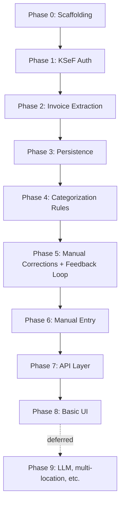

# KSeF Exporter — Implementation Plan

**Companion document to** [`SPEC.md`](./SPEC.md). Read that first for the business context and KSeF integration mechanics — this document is the step-by-step build order.

**Audience:** Developers / AI coding agents implementing this system.

---

## Engineering conventions (apply to every phase below)

- **Testing is mandatory, not optional.** Every feature or change implemented from this plan must ship with automated tests covering it. A feature is only considered "done" once its tests exist **and pass** (verified by actually running them). Never report a phase/task as complete without this.
- **Test framework:** [Vitest](https://vitest.dev/).
- **No real network calls to KSeF in unit tests.** All KSeF HTTP interactions must be mockable/injectable (e.g. via `ksef-client`'s options or an HTTP mocking layer) so the default test run is fast, deterministic, and doesn't depend on external systems. Optional integration tests against `https://api-test.ksef.mf.gov.pl` may be added later, gated behind an environment variable so they don't run by default.
- **Language/runtime:** TypeScript, Node.js ≥ 20 (required by `ksef-client`).
- **Package manager:** pnpm.
- **Linting/formatting:** [Biome](https://biomejs.dev/) — a single fast tool replacing ESLint + Prettier; type-aware checks are still covered separately via `tsc --noEmit` (`pnpm run typecheck`).
- **Database:** SQLite via [Drizzle ORM](https://orm.drizzle.team/) — zero-ops, fits self-hosted single-user deployment; swappable later if multi-user/cloud requires it.
- **API layer (from Phase 7 onward):** [Fastify](https://fastify.io/) — lightweight, TypeScript-friendly.
- **Structure:** start as a single package (root-level `src/`) organized by domain module. A separate frontend app is introduced only at Phase 8; restructure into a workspace at that point if needed, not before.

---

## Phase 0 — Project scaffolding

**Goal:** A working, tested, lintable TypeScript project skeleton with CI-ready tooling — nothing KSeF-specific yet.

Tasks:
- `pnpm init`, TypeScript config (`tsconfig.json`), strict mode on.
- Biome config (`biome.json`) for linting + formatting.
- Vitest configured and runnable (`pnpm test`).
- Basic folder layout: `src/`, `src/config/` (env loading/validation), `test/` or co-located `*.test.ts`.
- `.env.example` documenting required environment variables as they're introduced in later phases.
- A trivial smoke test (e.g. config loader test) to prove the pipeline works end-to-end.

Definition of done: `pnpm run lint`, `pnpm run build`, and `pnpm test` all succeed on a clean checkout.

**Status: done.** Scaffolding in place (`package.json`, `tsconfig.json`, `biome.json`, `vitest.config.ts`, `.env.example`, `.gitignore`, `pnpm-workspace.yaml`) plus the Phase 1 config loader (`src/config/env.ts`) and its tests (`src/config/env.test.ts`) as the smoke test. `pnpm run typecheck`, `pnpm run lint`, and `pnpm test` all pass. pnpm pinned at `11.10.0` (installed via Homebrew).

---

## Phase 1 — KSeF authentication module

**Goal:** Obtain and maintain a valid `accessToken` automatically, per SPEC §3.1, without human interaction beyond the one-time KSeF Token setup.

Tasks:
- Add `ksef-client` dependency.
- `src/ksef/auth.ts`: wraps the KSeF-token auth flow (challenge → encrypt → submit → poll → redeem) behind a small internal interface, e.g. `KsefAuthService.getAccessToken()`.
- Token lifecycle handling: cache `accessToken` in memory with expiry tracking; transparently refresh via `refreshToken`; transparently re-run full auth when `refreshToken` is no longer valid.
- Config: `KSEF_TOKEN`, `KSEF_NIP`, `KSEF_ENVIRONMENT` (`TEST`/`DEMO`/`PRD`) read via the Phase 0 config loader, validated at startup (fail fast with a clear error if missing).
- Secrets hygiene: never log token values; redact in error messages.

Tests (mocked KSeF API, no real network calls):
- Successful auth flow end-to-end (challenge → encrypted submit → poll success → redeem) returns a usable access token.
- Token reuse: a second call within the token's validity window does **not** re-trigger the full auth flow.
- Refresh path: an expired `accessToken` but valid `refreshToken` triggers `/auth/token/refresh`, not a full re-auth.
- Full re-auth path: an expired `refreshToken` triggers the complete flow again from `/auth/challenge`.
- Failure handling: auth status polling that returns a failure/error status surfaces a clear, typed error (not a hang or generic crash).
- Config validation: missing/invalid `KSEF_TOKEN`/`KSEF_NIP` fails fast with a descriptive error.

Definition of done: all tests above pass; a manual `.env`-driven smoke script can obtain a token against the **test** KSeF environment (documented, not part of the automated suite).

**Status: done.** `ksef-client` (community TS SDK, per SPEC §3.5) already implements the full challenge→encrypt→submit→poll→redeem flow inside `KsefClient.connect()`, and transparently refreshes the access token via `AuthManager.getAccessToken()`. `src/ksef/client.ts` wraps this in a `KsefSessionManager`: lazily connects once, delegates token refresh entirely to the SDK, and transparently re-runs the full auth flow (at most once) when the SDK signals `KsefSessionExpiredError` (refresh token dead). Connection is injected (`ConnectFn`) so tests never touch the network. `src/ksef/client.test.ts` covers: happy path, session reuse (no re-auth), delegated access-token refresh, full re-auth on session expiry, no infinite retry loop, and connection-failure propagation/retry-ability — 7 tests, all passing. `src/ksef/smoke.ts` (`pnpm run smoke:ksef`) is the manual, non-automated real-environment check called for above.

---

## Phase 2 — Invoice extraction module

**Goal:** Reliably pull all purchase invoices for a given date range from KSeF into flat, de-duplicated records, per SPEC §3.2.

Tasks:
- `src/ksef/export.ts`: initiate `/invoices/exports` with `subjectType=Subject2`, `dateType=PermanentStorage`, client-generated encryption; poll `/invoices/exports/{referenceNumber}` until complete.
- `src/ksef/package.ts`: download package parts, AES-256 decrypt, unzip, parse `_metadata.json`.
- `src/ksef/invoice-parser.ts`: parse invoice XML (FA(2)/FA(3)) into the flat header record from SPEC §3.4 (KSeF number, seller/buyer NIP+name, dates, totals, currency); retain raw XML.
- `src/ksef/sync.ts`: orchestrates the High-Water-Mark continuation logic — given a starting point (or none, for first run), fetches one or more contiguous windows, de-duplicates by KSeF number, and returns the new HWM to persist for next time.
- Persist HWM state (initially can be a simple table/row via the Phase 3 DB layer, introduced next — sequence these two phases together if convenient).

Tests (mocked KSeF API + fixture invoice XML/zip data):
- Happy path: a single non-truncated export window produces the expected parsed invoices and an updated HWM equal to `permanentStorageHwmDate`.
- Truncated package: `isTruncated=true` response causes continuation from `lastPermanentStorageDate` on the next call, not `permanentStorageHwmDate`.
- De-duplication: an invoice appearing in two overlapping/adjacent windows' `_metadata.json` is only stored/returned once.
- Rate limiting: a `429` response with `Retry-After` is retried rather than failing immediately (verify backoff behavior, not necessarily real timing — inject a fake clock/timer).
- XML parsing: a representative FA(2) and FA(3) sample invoice each parse into the correct flat record shape.
- Corrupted/undecryptable package part surfaces a clear error rather than crashing silently or returning partial garbage data.

Definition of done: all tests above pass; running the sync module against recorded fixture data produces the exact expected set of invoice records with no duplicates and no gaps.

---

## Phase 3 — Persistence layer

**Goal:** Durable local storage for invoices, categorization rules, category assignments, manual entries, and sync state.

Tasks:
- Drizzle schema (SQLite) covering (at minimum):
  - `invoices` (KSeF-sourced + manual, distinguished by a `source` column per SPEC §4).
  - `categories` (Media / Zakup towarów / Inne, extensible).
  - `categorization_rules` (condition → category, e.g. seller NIP or name-contains match, per SPEC §2.6 seed rules).
  - `sync_state` (HWM continuation point per subject type).
- Migration tooling wired up (`drizzle-kit` or equivalent) and a documented `npm run migrate` command.
- Repository/data-access modules (`src/db/invoices.ts`, `src/db/rules.ts`, etc.) — thin, typed wrappers, no business logic here.

Tests:
- Schema/migration applies cleanly to a fresh SQLite file.
- CRUD round-trip tests for each repository module (insert/read/update invoices, rules, sync state).
- Uniqueness constraint test: inserting the same KSeF invoice number twice is rejected or upserted safely (matches the de-dup guarantee from Phase 2).

Definition of done: all tests above pass against a real (file or in-memory) SQLite instance created fresh per test run.

---

## Phase 4 — Categorization engine (Tier 1 rules)

**Goal:** Deterministic categorization of invoices per SPEC §4, seeded with the rules from SPEC §2.6.

Tasks:
- `src/categorization/engine.ts`: given an invoice record and the current rule set, return a category + a confidence flag (`matched` vs `needs_review`).
- Rule matching: seller NIP exact match preferred; seller-name substring match as fallback/bootstrap (seed data from SPEC §2.6).
- Seed migration/script to load the initial rule set from SPEC §2.6 into `categorization_rules` on first run.
- Integration point: after Phase 2 sync produces invoices and Phase 3 persists them, run each new invoice through the engine and persist the resulting category + confidence.

Tests:
- Each seed rule (Energa/Enea/PGNiG/T-Mobile/Wodociągi/Odpady → Media; Eurocash/Piwowar/Pepsi/Triada → Zakup towarów; Ochrona/Securitas/Leasing/Skoda/OBI/Castorama → Inne) categorizes a matching sample invoice correctly.
- An invoice matching no rule is flagged `needs_review`, not silently mis-categorized.
- NIP match takes precedence over a name-based rule when both could apply (if/when both exist for the same seller).
- Engine is a pure function of (invoice, rule set) — same inputs always produce the same output (no hidden state/order-dependence bugs).

Definition of done: all tests above pass; running the engine over the full seed-rule test matrix from SPEC §2.6 produces 100% expected matches.

---

## Phase 5 — Manual corrections & rule feedback loop

**Goal:** Let a human override a category (HU-04) and have that correction improve future automatic categorization.

Tasks:
- `src/categorization/correct.ts`: given an invoice ID and a new category, update the stored assignment and (per SPEC §4) offer/create a new Tier-1 rule (e.g. "seller NIP X → category Y") so future invoices from the same seller auto-categorize correctly.
- Guard against duplicate/conflicting rules (e.g. re-correcting the same seller should update the existing rule, not create a second conflicting one).

Tests:
- Correcting a `needs_review` invoice updates its category and creates a new rule for that seller NIP.
- A subsequent new invoice from the same seller NIP is now auto-categorized (`matched`) using the new rule — i.e. the feedback loop is verified end-to-end, not just the rule's existence.
- Re-correcting an already-ruled seller updates the existing rule rather than creating a duplicate.

Definition of done: all tests above pass, including the end-to-end feedback-loop test.

---

## Phase 6 — Manual entry of exceptions (HU-02)

**Goal:** Support entering costs that structurally cannot come from KSeF (foreign vendors, small receipts).

Tasks:
- `src/invoices/manual-entry.ts`: create an invoice-like record with `source = "manual"` and user-supplied fields (seller name, amount, date, category — category can be chosen directly, bypassing the rules engine, or still run through it for consistency — decide during implementation and document the choice).
- Validation: required fields, sane amount/date formats.

Tests:
- A manually entered record is stored correctly and appears alongside KSeF-sourced invoices in the same query/reporting path (per SPEC §4, `source` distinguishes but doesn't fork logic).
- Invalid input (missing amount, malformed date, etc.) is rejected with a clear validation error.

Definition of done: all tests above pass.

---

## Phase 7 — Engine API layer

**Goal:** Expose the engine (Phases 1–6) over HTTP so both a future UI and manual/CLI use can drive it, per SPEC's priority of having "the engine" usable before any UI exists.

Tasks:
- Fastify app (`src/api/server.ts`) with, at minimum:
  - `POST /sync` — trigger a KSeF fetch for a given month/date range (HU-01).
  - `GET /invoices` — list invoices with category + confidence, filterable by month/category.
  - `PATCH /invoices/:id/category` — manual correction (HU-04), invoking Phase 5 logic.
  - `POST /invoices/manual` — manual entry (HU-02), invoking Phase 6 logic.
- Basic auth/login (JWT-based per SPEC §2.2.4) protecting all routes — minimal but real (not a stub), since the spec treats this as a hard requirement even for the engine-only stage.
- Input validation and consistent error responses across routes.

Tests:
- Each route: happy path + at least one validation/error-path test, using Fastify's injectable test client (no real HTTP server needed).
- Auth: unauthenticated requests to protected routes are rejected; authenticated requests succeed.
- `POST /sync` triggering the Phase 2 sync module is tested with the module mocked at this layer (its own correctness is already covered in Phase 2's tests).

Definition of done: all tests above pass; the full engine is operable via HTTP calls alone (documented with example `curl`/HTTP requests), with no UI required.

---

## Phase 8 — Basic UI

**Goal:** A minimal, login-protected web UI satisfying HU-01 through HU-04, built on top of the Phase 7 API — no new business logic here.

Tasks (exact frontend framework to be decided at this phase's start, e.g. a lightweight React + Vite app):
- Login screen (JWT auth against the Phase 7 API).
- Table view grouped/filterable by category, with a clear visual distinction between "confident" and "needs review" rows (HU-03).
- One-click "fetch this month" trigger calling `POST /sync` (HU-01).
- Category correction via dropdown per row, calling `PATCH /invoices/:id/category` (HU-04).
- A manual-entry form calling `POST /invoices/manual` (HU-02).

Tests:
- Component/unit tests for the category-correction and manual-entry interactions (e.g. using Vitest + a component-testing library appropriate to the chosen framework).
- At least one end-to-end happy-path test (e.g. login → view invoices → correct a category) if a suitable lightweight E2E tool is introduced; otherwise document this as a known gap rather than silently skipping it.

Definition of done: all tests above pass; a person can perform the full HU-01→HU-04 loop through the UI alone against a running backend.

---

## Phase 9 — Deferred (not part of this plan's execution)

Tracked for later, per SPEC §5 — do not start without explicit request:
- LLM categorization tier (Tier 2) behind the `CategorizationProvider` interface referenced in SPEC §4.
- Multi-location/multi-entity support.
- Sales/turnover invoice ingestion.
- Payroll import/automation.
- Background/scheduled sync.
- Cloud hosting/deployment hardening.

---

## Execution order summary

Phases 3 and 4 may be interleaved with Phase 2 in practice (invoices need somewhere to land as soon as they're parsed), but the dependency order above must be respected — no phase should be considered done ahead of its prerequisites, and no phase's completion is claimed without passing tests per the conventions above.
